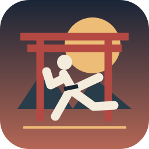
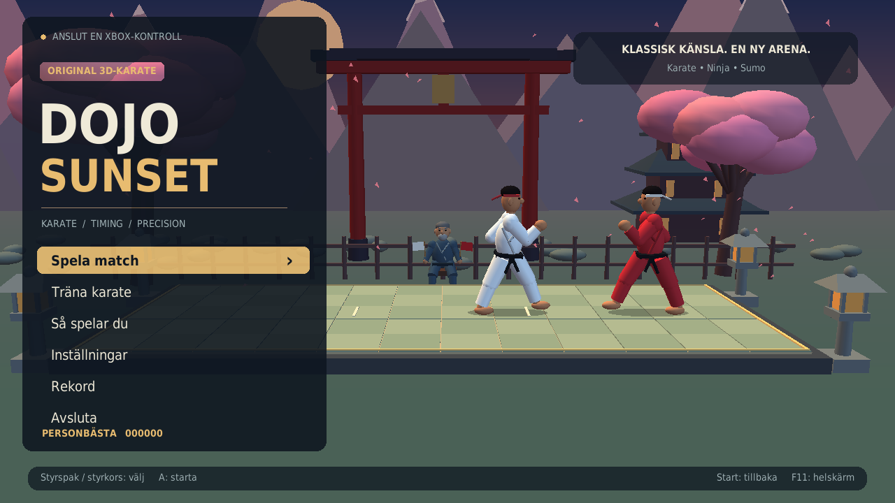
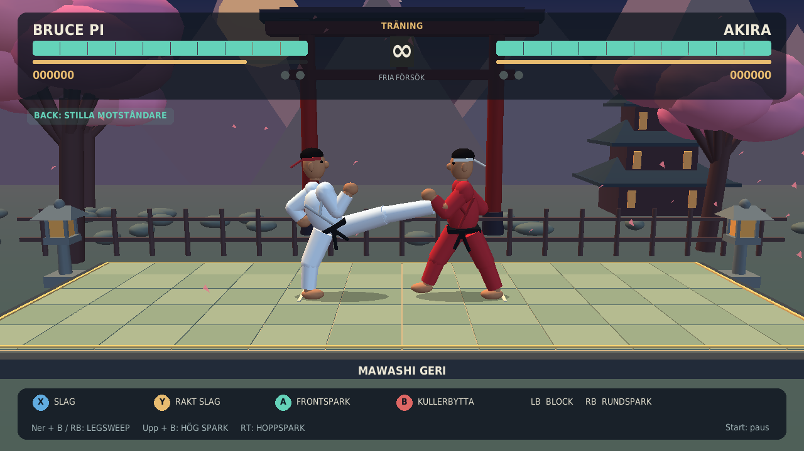
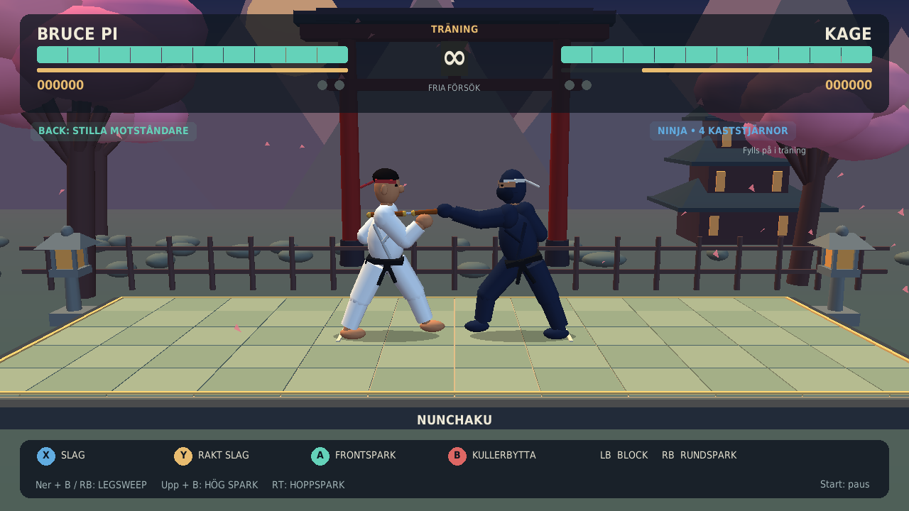
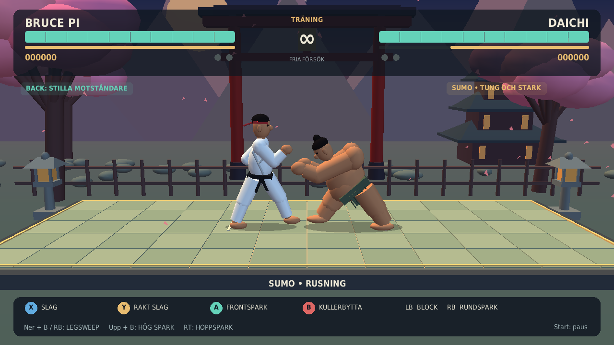
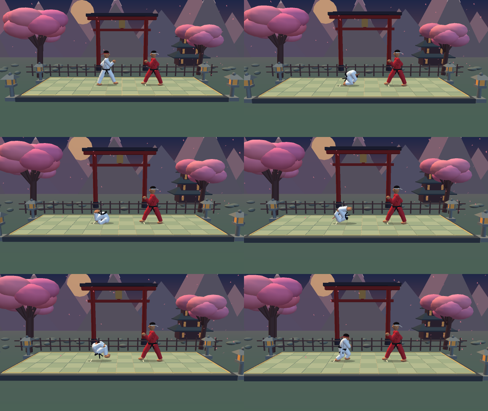

<div align="center">



# Dojo Sunset

**Ett handgjort 3D-karatespel för Raspberry Pi, byggt med Python, Pygame och OpenGL.**

[](https://www.python.org/)
[](https://www.pygame.org/)
[](LICENSE)
[](TESTRAPPORT.md)



*Klassisk karatekänsla, moderna kontroller och en helt egen arena i solnedgången.*

</div>

## Om spelet

Dojo Sunset är ett controller-fokuserat kampspel inspirerat av känslan i
klassiska karatespel. All grafik består av egna 3D-modeller som ritas i realtid.
Resan börjar med traditionell poängkarate och fortsätter mot beväpnade ninjor
och tunga sumobrottare.

- Klassisk poängkarate och hälsodueller
- Karateresan med sex motståndare: karate, ninja och sumo
- Lokal tvåspelare med Xbox-kontroller eller SPEEDLINK Competition Pro USB
- Tolv interaktiva lektioner i Teknikskolan
- Fri träning mot karate-, ninja- och sumomotståndare
- Egna animationer, partikeleffekter och bearbetade ljudeffekter
- Rekord, svårighetsgrader, helskärm och två arenalägen

## Galleri

| Karate | Ninja |
|:---:|:---:|
|  |  |
| **Sumo** | **Kullerbytta** |
|  |  |

## Snabbstart

### Raspberry Pi / Debian / Ubuntu

```bash
git clone https://github.com/NoCoderRandom/dojo-sunset.git
cd dojo-sunset
python3 -m venv .venv
source .venv/bin/activate
python -m pip install -e .
python main.py --windowed
```

Anslut en Xbox-kontroll eller SPEEDLINK Competition Pro USB innan du startar.
Spelets menyer och fighters styrs med kontroll; tangentbordet används bara för
`F11` (helskärm) och `F10` (skärmbild). Kontroller väljs under
**Inställningar → Välj kontroller**.
På den ursprungliga Raspberry Pi-installationen kan spelet också startas med
`./start.sh` eller skrivbordsikonen **Spela Dojo Sunset**.

Krav: Python 3.11 eller senare, Pygame, NumPy, PyOpenGL och en fungerande
OpenGL-drivrutin.

## Kontroller

| Knapp | Funktion |
|---|---|
| Vänster spak / styrkors | Gå, huka eller hoppa |
| X | Snabbt slag; ner + X eller Y ger hukslag |
| Y | Kraftigare rakt slag |
| A | Frontspark; ner + A ger låg spark |
| B | Kullerbytta framåt |
| Upp + B | Hög spark |
| Ner + B eller ner + RB | Lågt svep / ashi barai |
| RB | Roterande rundspark |
| RT | Hoppspark |
| LB | Blockera; ner + LB blockerar lågt |
| LT | Undanmanöver bakåt |
| Start | Paus / tillbaka |
| Back | Växla AI i träning |

SPEEDLINK Competition Pro läses direkt som digital styrspak med fyra fysiska
knappar. Den vänstra stora knappen väljer i menyer och den högra stora går
tillbaka. Tryck alla fyra knappar samtidigt för paus. Stödet är helt lokalt i
spelet och ändrar inga kontrollinställningar i operativsystemet.

Menyer styrs med spak eller styrkors. A bekräftar och B går tillbaka. En
detaljerad svensk spelguide finns i [SPELGUIDE.md](SPELGUIDE.md).

## Spelsätt

### Karateresan

Möt AKIRA och REN i klassisk poängkarate, ninjorna KAGE och YORU och slutligen
sumobrottarna DAICHI och RAIDEN. Två vunna ronder vinner matchen. Rekordpoängen
följer med genom hela resan.

### Två spelare

Välj **Spela match → 2 spelare** och anslut två Xbox- eller SPEEDLINK-kontroller.
Båda spelarna trycker A på klarskärmen. Vänskapsmatcher påverkar inte
rekordtabellen.

### Träning och Teknikskolan

Träningsläget saknar tidsgräns och låter dig slå av eller på motståndarens
AI. Teknikskolan innehåller tolv praktiska lektioner som kontrollerar att varje
rörelse utförs korrekt.

## Utveckling

Kör hela testsviten:

```bash
python3 -m unittest discover -s tests -v
```

Kör ett snabbt grafik- och menyprov:

```bash
python3 main.py --windowed --smoke --mute
```

Projektet har 165 automatiserade tester för strid, kontroller, tvåspelarläge,
ljud, lagring, handledning och applikationsflöde. Utförlig information finns i
[TESTRAPPORT.md](TESTRAPPORT.md).

## Data och säkerhet

Inställningar, rekord, loggar och skärmbilder sparas lokalt i `userdata/`, som
inte versionshanteras. Spelet ändrar inga globala kontrollprofiler, Bluetooth-
inställningar, RetroArch-filer eller EmulationStation-filer.

## Licens och ljud

Källkod, egen grafik och syntetiska ljud distribueras under [MIT-licensen](LICENSE).
Blockljudet kommer från en CC0-källa. Fullständig information om ljudens ursprung
och bearbetning finns i [CREDITS.md](CREDITS.md).
